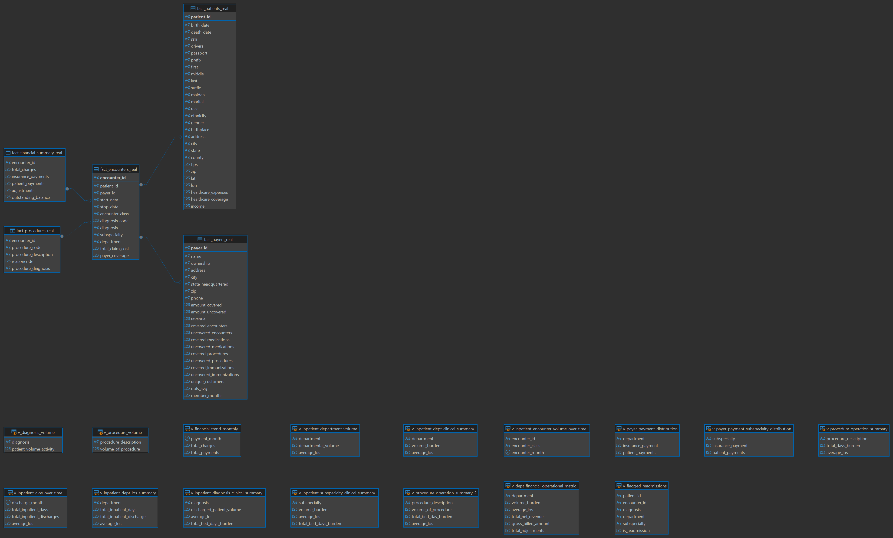
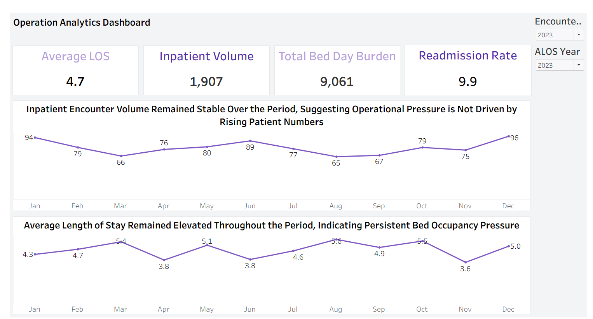
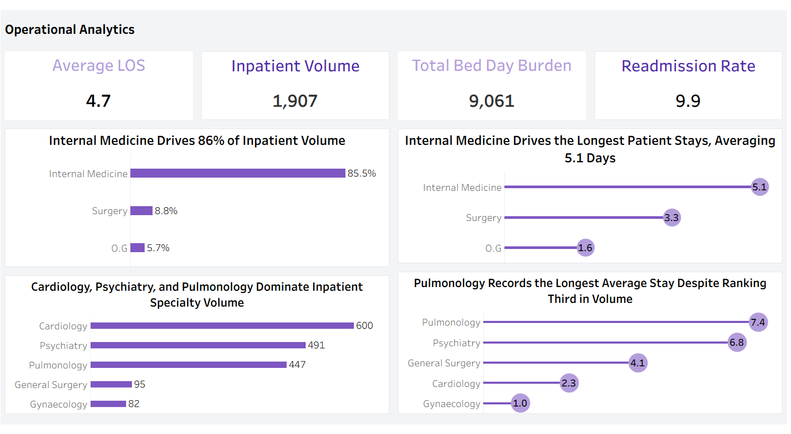
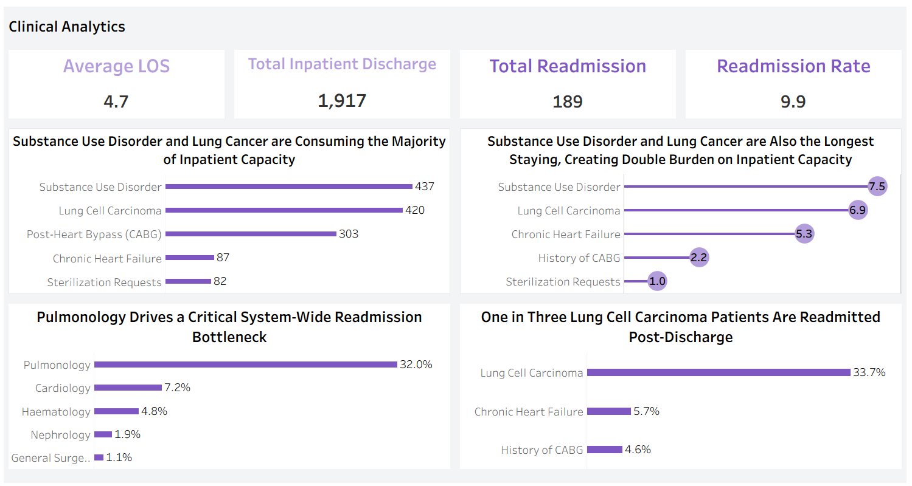
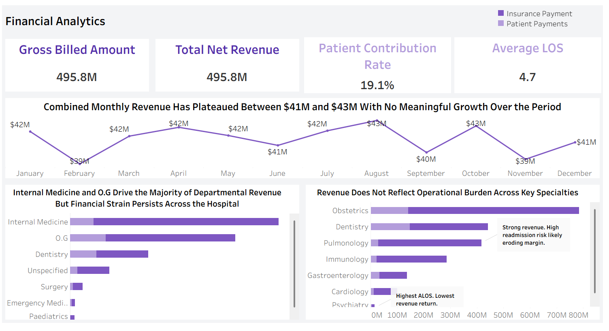

# Hospital Operations Performance Analysis: Identifying Drivers of Length of Stay, Readmissions, and Financial Performance
> *Analyzed hospital-wide operational and financial data to identify the drivers of prolonged length of stay, readmissions, bed occupancy pressure, and revenue performance, delivering actionable insights to improve patient flow and operational efficiency.*

---

## ⚙️ Project Type

**End-to-End Healthcare Analytics Project**

**Techniques Used**
- [x] Data Cleaning / Wrangling
- [x] Exploratory Data Analysis (EDA)
- [x] SQL Analysis / Querying
- [x] Dashboard / Data Visualization

---

## Table of Contents
1. [Project Overview](#1-project-overview)
2. [Objectives](#2-objectives)
3. [Project Scope & Tools](#3-project-scope--tools)
4. [Repository Structure](#4-repository-structure)
5. [Data Workflow](#5-data-workflow)
6. [Data Model & Schema](#6-data-model--schema) 
7. [ERD - Entity Relationship Diagram](#7-erd---entity-relationship-diagram)
8. [Analysis & Metrics](#8-analysis--metrics)
9. [Key Insights](#9-key-insights)
10. [Recommendations](#10-recommendations)
11. [Limitations](#limitations)
12. [Deliverables](#13-deliverables)
13. [Author](#14-author)

---

## 1. Project Overview

**Context:** 

A large tertiary hospital had experienced increasing operational and financial pressure over an 24-month period. Leadership observed prolonged inpatient stays, rising bed occupancy, delayed patient turnover, higher readmission rates, and growing financial strain despite sustained patient activity.

**Problem Statement:** 

Hospital leadership needed a data-driven investigation to identify the factors contributing to prolonged length of stay, readmissions, and capacity constraints. The objective was to determine which departments were under the greatest operational pressure, assess the impact on financial performance, and provide actionable recommendations to improve patient flow, operational efficiency, and patient outcomes.

**Approach:**

Cleaned and standardized five hospital datasets using Excel Power Query before integrating them in PostgreSQL through relational joins on Encounter, Patient, and Payer IDs.

Using SQL, I analyzed key operational and financial metrics including Average Length of Stay (ALOS), bed-day burden, readmission rate, inpatient volume, and revenue. The results were then connected to Tableau to build an interactive dashboard with KPIs and visualizations that supported trend analysis, departmental comparisons, segmentation, and root cause analysis.

**Outcome:** 

Developed an executive Tableau dashboard, analytical report, and presentation that uncovered the primary drivers of prolonged hospital stays, readmissions, and capacity constraints.

The analysis showed that operational inefficiencies, rather than increasing patient volume, were placing the greatest strain on hospital resources and provided actionable recommendations to improve patient flow, optimize bed utilization, and support better financial and operational decision-making.

---

## 2. Objectives

- **Primary Objective:** Determine the key operational factors driving inpatient capacity constraints and evaluate their impact on hospital performance to support data-driven decision-making.

- **Secondary Objective 1:** Analyze seasonal inpatient admission patterns to determine whether capacity pressure is driven by increasing patient volume or operational inefficiencies.

- **Secondary Objective 2:** Identify the departments, diagnoses, and readmission patterns contributing most to prolonged length of stay, bed-day utilization, and repeat hospitalizations.

- **Secondary Objective 3:** Evaluate the relationship between operational performance and financial outcomes, then develop an interactive Tableau dashboard to communicate key insights and support executive decision-making.

## 3. Project Scope & Tools

### Scope

| Dimension | Details |
|-----------|---------|
| **In Scope** | Analysis of five relational hospital datasets covering inpatient encounters, patient demographics, procedures, payer information, and financial performance. The project evaluated operational, clinical, and financial KPIs across hospital departments using SQL and Tableau. |
| **Out of Scope** | Operational cost accounting, clinical severity (acuity) scores, and post-discharge follow-up data were excluded because these variables were not available in the source datasets, limiting detailed cost analysis and identification of clinical causes of prolonged stays and readmissions. |
| **Time Period** | January 2023 to December 2024 (24 months).|
| **Granularity** | One row per inpatient encounter, enriched with patient, procedure, payer, and financial information through relational joins. |

### Tools & Technologies

| Category | Tool(s) Used |
|----------|-------------|
| Data Storage |PostgreSQL |
| Data Processing | Microsoft Excel (Power Query), SQL (PostgreSQL) |
| Analysis |SQL (PostgreSQL) |
| Visualization | Tableau |
| Version Control | Git & GitHub |
| Documentation |Markdown (GitHub README) |
| Other | DBeaver |

---

## 4. Repository Structure

Hospital-Operations-Performance-Analysis/

│

├── README.md

│

├── data/

│   ├── raw/

│   └── processed/

│

├── queries/

│   └── hospital_operations_analysis.sql

│

├── dashboards/

│   └── Hospital_Operations_Dashboard.twb

│

├── reports/

│   └── Executive_Report.pdf

│

├── visuals/

│   ├── hospital_erd.png

│   ├── dashboard_01_overview.png

│   ├── dashboard_02_operational.png

│   ├── dashboard_03_departmental.png

│   ├── dashboard_04_clinical.png

│   └── dashboard_05_financial.png               

## 5. Data Workflow

### 🔄 Data Workflow

```text

Five Relational Hospital Datasets

(Fact Encounter, Fact Patient, Fact Procedure, Fact Financial Summary, Fact Payer)

       ↓
Microsoft Excel (Power Query)

Data quality checks, character encoding cleanup, and data standardization

       ↓
PostgreSQL

Relational joins using Encounter ID, Patient ID, and Payer ID

       ↓
SQL Analysis

Calculated operational and financial KPIs, performed trend, ranking, 

segmentation, and root cause analysis, and created reusable SQL views

       ↓
Tableau

Connected SQL views, created calculated fields, built KPI cards, 

and developed interactive dashboards

       ↓
Deliverables

Executive dashboard, analytical report, and business recommendations
```

1. **Source:** Five relational hospital datasets in CSV format generated using Synthea, representing inpatient encounters, patient demographics, procedures, payer information, and financial data for the period January 2023 to December 2024.
   
3. **Ingestion:** Imported the CSV files into Microsoft Excel (Power Query) for initial preprocessing before loading the cleaned datasets into PostgreSQL for relational analysis.
   
4. **Cleaning:** Resolved character encoding issues, removed leading and trailing spaces, and standardized the datasets to improve data quality and ensure consistency before analysis.
   
5. **Transformation:** Integrated the five datasets in PostgreSQL using Encounter ID, Patient ID, and Payer ID. Created reusable SQL views and derived fields to support KPI calculations, while preparing the underlying data required for metrics such as Average Length of Stay (ALOS) and Readmission Rate. Final calculated fields were implemented in Tableau for dashboard reporting.
   
6. **Analysis:** Used SQL to calculate operational and financial KPIs and perform trend analysis, departmental comparisons, ranking, segmentation, and root cause analysis. Connected the SQL views to Tableau to develop interactive dashboards and KPI visualizations.

7. **Output:** Produced an interactive Tableau dashboard, an executive analytical report, and business recommendations to support operational, clinical, and financial decision-making.

---

## 6. Data Model & Schema

### Dataset / Table: `[name]`

| Field Name | Data Type | Description | Example Value |

| Encounter ID | String | Unique identifier for each hospital encounter. | ENC-102345 |

| Patient ID | String | Identifies the patient associated with the encounter. | PAT-004521 |

| Payer ID | String | Identifies the payer responsible for the encounter. | PAY-012 |

| Start Date | Date | Admission date of the encounter. | 2023-01-15 |

| Stop Date | Date | Discharge date of the encounter. | 2023-01-20 |

| Encounter Class | String | Type of hospital encounter. | Inpatient |

| Diagnosis Code | String | Standardized clinical code assigned to the primary diagnosis. | 72892002 |

| Diagnosis | String | Primary diagnosis associated with the encounter. | Normal pregnancy |

> **Row count (approx.):** 936,000+ rows

> **Date range:** January 2023 – December 2024

> **Key join / relationship:** patient_id → Fact Patient.patient_id, payer_id → Fact Payer.payer_id, encounter_id → Fact Procedure.encounter_id, encounter_id → Fact Financial Summary.encounter_id

> **Note:** The project uses five relational tables. The schema above presents a representative sample from the central **Fact Encounter** table. The complete table relationships are illustrated in the **Entity Relationship Diagram (ERD)** in the next section.

## 7. ERD - Entity Relationship Diagram

The Entity Relationship Diagram (ERD) illustrates the relational structure of the hospital database used in this project. The **Fact Encounter** table serves as the central fact table and is linked to the **Fact Patient**, **Fact Procedure**, **Fact Financial Summary**, and **Fact Payer** tables through shared keys.



*Figure 1. Entity Relationship Diagram showing the relational schema and key relationships across the five hospital datasets.*
---

## 8. Analysis & Metrics

### Analytical Approach

This project followed a business intelligence and diagnostic analytics approach to investigate hospital-wide operational performance. Rather than testing a predefined statistical hypothesis, the analysis explored patterns across patient flow, inpatient capacity, readmissions, and financial performance to identify the underlying drivers of operational inefficiency.
Data from five relational hospital datasets was integrated using SQL, where key operational and financial metrics were calculated. The results were analyzed using trend analysis, departmental ranking, segmentation, and root cause analysis before being presented through interactive Tableau dashboards to support executive decision-making.


### Key Metrics Defined
| Metric | Plain-Language Definition | Why It Matters |
|--------|--------------------------|----------------|
| Average Length of Stay (ALOS) | The average number of days patients remained admitted before discharge. | Measures hospital efficiency and helps identify departments experiencing prolonged inpatient stays. |
| Readmission Rate | The percentage of patients who returned for inpatient care within the defined readmission period after discharge. | Indicates the quality of care transitions and highlights areas contributing to recurring hospital utilization. |
| Total Bed-Day Burden | The total number of inpatient bed days consumed across all encounters. | Quantifies overall pressure on hospital capacity and resource utilization. |
| Inpatient Volume | The total number of inpatient encounters during the analysis period. | Determines whether operational pressure is driven by patient demand or internal inefficiencies. |
| Total Revenue | The total net revenue generated from inpatient encounters. | Evaluates financial performance alongside operational activity. |
| Gross Billed Amount | The total charges billed before contractual adjustments or payments. | Provides context for comparing hospital billing activity with realized revenue. |
| Patient Contribution Rate | The proportion of encounters attributed to each department or diagnosis group. | Identifies which service lines contribute most to hospital workload and capacity demand. |

### Methods Used

- Time-series trend analysis to evaluate monthly patterns in inpatient volume, average length of stay (ALOS), and financial performance.
- Departmental ranking and comparative analysis to identify high-burden specialties based on patient volume, bed-day utilization, readmissions, and revenue.
- Segmentation analysis to compare operational and financial performance across departments and diagnosis groups.
- Root cause analysis to investigate the operational drivers of prolonged hospital stays, readmissions, and capacity constraints.
- Relational SQL joins to integrate five hospital datasets using Encounter ID, Patient ID, and Payer ID.
- SQL aggregation, grouping, and reusable views to calculate operational and financial KPIs.
- Tableau calculated fields and interactive dashboards to visualize performance metrics and support executive decision-making.

---

## 9. Key Insights

 

### Insight 1: Prolonged Patient Stays, Not Rising Admissions, Drove Capacity Pressure

Analysis of monthly inpatient encounters showed a relatively stable admission pattern throughout the 24-month period, with predictable seasonal peaks in January (94 encounters) and December (96 encounters). However, Average Length of Stay (ALOS) remained consistently elevated, frequently ranging between 5.1 and 5.6 days, even during lower-volume months.

These patterns indicate that the hospital’s capacity constraints were driven primarily by prolonged inpatient stays rather than increasing patient demand. As patients occupied beds for longer durations, bed availability declined, turnover slowed, and the hospital’s ability to accommodate new admissions became increasingly constrained.



### Insight 2: A Small Number of High-Burden Service Areas Accounted for a Disproportionate Share of Bed Capacity Pressure

At the department level, **Internal Medicine** accounted for **85.5%** of all inpatient encounters, making it the hospital's busiest department. Within Internal Medicine, **Pulmonology** recorded the longest Average Length of Stay (ALOS) at **7.4 days**, while the **Psychiatry** department also reported a prolonged ALOS of **6.8 days**.

Although Pulmonology and Psychiatry managed fewer patients than the broader Internal Medicine department, their extended inpatient stays consumed a disproportionate share of hospital bed capacity. These findings indicate that a relatively small number of high-burden service areas were responsible for a significant share of the hospital's capacity constraints.

**Insight 3:**


### Insight 3: Diagnosis-Level Analysis Revealed the Primary Drivers of Prolonged Stays and Readmissions

To understand why **Pulmonology** and **Psychiatry** experienced prolonged inpatient stays, the analysis was further segmented by diagnosis. This revealed **Lung Cancer** as the primary high-burden diagnosis within Pulmonology and **Substance Use Disorder** as the leading contributor within Psychiatry.

Patients admitted with Substance Use Disorder recorded some of the longest initial hospital stays, averaging **7.5 days**, while Lung Cancer patients averaged **6.9 days** and accounted for **32%** of all hospital readmissions. Further analysis showed that **33.7%** of Lung Cancer patients were readmitted following discharge, indicating that readmissions were concentrated within a specific high-risk patient group rather than being evenly distributed across the hospital population. 

These recurring admissions placed sustained pressure on inpatient bed capacity and patient flow.

**Insight 4:** 


High Clinical Burden Reduced Financial Performance Despite Strong Patient Demand

Financial analysis showed that monthly net revenue remained relatively stable, ranging between **$41M and $43M**, despite sustained inpatient demand and consistently high bed occupancy. This plateau indicates that the hospital's financial performance was constrained by inpatient capacity rather than a lack of patient activity.

Among the high-burden service areas, **Psychiatry** stood out for consuming a substantial share of inpatient bed days while generating comparatively lower financial returns. More broadly, service areas with prolonged average lengths of stay tied up valuable bed capacity, limiting patient turnover and reducing opportunities to admit additional patients. 

These findings demonstrate that high clinical burden not only placed pressure on hospital operations but also restricted the organization's ability to maximize revenue from existing resources.

## 10. Recommendations

| Priority | Recommendation | Based On | Suggested Owner |
|----------|---------------|----------|-----------------|
| High | Review inpatient care pathways to identify operational factors contributing to prolonged hospital stays and reduced bed turnover, such as discharge coordination delays and patient acuity-related care transitions, before implementing targeted capacity interventions. | Insight 1: Prolonged patient stays, not rising admissions, drove capacity pressure. | Hospital Operations Leadership |
| High | Increase nursing, care coordination, and operational staffing support within Pulmonology and Psychiatry to improve care delivery, coordinate timely workflows, and reduce extended inpatient stays. | Insight 2: A small number of high-burden service areas accounted for a disproportionate share of bed capacity pressure. | Departmental Leadership |
| High | Implement structured post-discharge follow-up programs for high-risk Lung Cancer patients and review transition pathways for long-stay Psychiatry patients to reduce avoidable readmissions. | Insight 3: Diagnosis-level analysis identified the primary drivers of prolonged stays and readmissions. | Clinical Leadership |
| Medium | Conduct discharge readiness and inpatient care pathway audits to distinguish delays caused by clinical complexity from administrative or operational bottlenecks. | Insights 2 & 3: Prolonged stays varied across service areas and diagnoses. | Quality Improvement Team |
| Medium | Align budget allocation with actual bed-day utilization and quantify the financial impact of prolonged stays and readmissions to support evidence-based resource planning. | Insight 4: High clinical burden limited financial performance despite sustained patient demand. | Finance Leadership |
---


### 11. Limitations

- **Absence of Direct Cost and Margin Metrics:**  
  The dataset includes **Gross Billed Amount** and **Net Revenue** but does not contain internal operating costs or margin data. As a result, the analysis could not quantify the true financial impact or profit loss associated with prolonged hospital stays.

- **Lack of Clinical Severity and Acuity Data:**  
  The dataset does not include patient acuity scores or clinical severity measures. Consequently, the analysis cannot determine whether prolonged hospital stays were driven by operational inefficiencies or by medically necessary clinical stabilization.

- **No Post-Discharge Patient Tracking:**  
  Outpatient follow-up, medication adherence, and community-based care were not captured in the dataset. Therefore, the underlying causes of the **33.7% Lung Cancer readmission rate** could not be definitively linked to post-discharge care gaps or other external factors.


## 12. Deliverables

| Deliverable | Description | Location |
|-------------|-------------|----------|
| Hospital Dataset | Raw and processed datasets used for SQL analysis and dashboard development. Download links are provided in the `data` folder. | [`data/`](data/) |
| SQL Queries | SQL scripts used for data exploration, transformation, KPI calculations, and reusable views. | [`queries/`](queries/) |
| Tableau Dashboard | Interactive Tableau workbook containing the operational, clinical, and financial dashboards. | [`dashboard/`](dashboard/) |
| Executive Report | Executive presentation summarizing the analytical approach, key findings, insights, and recommendations. | [`reports/`](reports/) |
| Visual Assets | Entity Relationship Diagram (ERD) and dashboard screenshots referenced throughout the README. | [`visuals/`](visuals/) |

## 14. Author

**[Your Name]**
[Your role or title - current or target]

- 🔗 [LinkedIn URL]
- 💼 [Portfolio or GitHub profile URL]
- 📧 [Email - optional]

---

*Last updated: [Month YYYY]*

